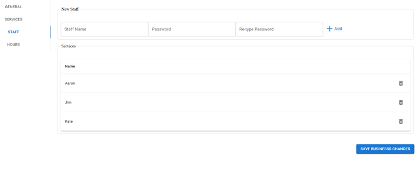

# Description

This is a full-stack web application that enables users to discover and book services from nearby cosmetic businesses. Users can search for beauty and wellness services, view business details, and schedule appointments, while businesses can register, manage their services, and accept bookings through the platform. The application provides an intuitive experience for both customers and business owners, ensuring seamless service discovery and booking management.

Built with the MERN stack (MongoDB, Express, React, Node.js), this project demonstrates my fullstack development skills, including user authentication, location-based searches, and business-service management.

## Features

- User authentication and authorization (JWT)
- Location-based searches
- Business-service management
- Responsive design for both desktop and mobile

## Tech Stack

- **Frontend**: React, Material UI
- **Backend**: Node.js, Express
- **Database**: MongoDB with Mongoose
- **Deployment**: Render

## Setup Instructions

1. Clone the repository:
   ```bash
   git clone https://github.com/ehsanh2001/glambook.git
   ```
2. Navigate into the project directory:

   ```bash
   cd glambook
   ```

3. Install dependencies:

   ```bash
   npm install
   ```

4. Set up the environment variables:

   Create a .env file in the server directory and include the following variables:

   ```bash
   MONGODB_URI=<your-mongodb-uri>
   JWT_SECRET_KEY=<your-jwt-secret>
   ```

   Create a .env file in the client directory and include the following variables:

   ```bash
   VITE_GOOGLE_API_KEY=<your-google-api-key-for-map>
   ```

5. From the root folder start the development server:

   ```bash
   npm run develop
   ```

The application should now be running on http://localhost:5173.

## Screenshots

### Main page


---

### Booking


---

### Business Registration Dashboard

## 

## 

## 


## Demo

Check out the live demo: [Glambook](https://glambook.onrender.com/)

Since the demo is running on free tier it can take a couple of minutes to start the server.

## How It Works

The backend is built with Node.js and Express, handling user authentication, task CRUD operations and booking. Data is stored in MongoDB, with Mongoose for object modeling. The frontend is developed using React by Vite development tool, and communicates with the backend API via Axios.

## Future Improvements

Implement booking reminders with email notifications
Improve the UI/UX for better accessibility

## Contact

**LinkedIn:** [https://www.linkedin.com/in/ehsan-hosseini-/](https://www.linkedin.com/in/ehsan-hosseini-/)

**Email:** e.hosseini.pbox@gmail.com
